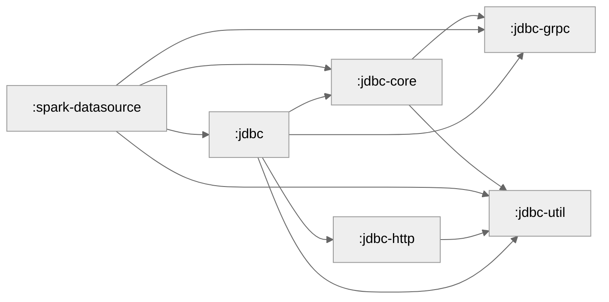

## Module Graph

```mermaid
%%{
  init: {
    'theme': 'neutral'
  }
}%%

graph LR
  :jdbc-core --> :jdbc-grpc
  :jdbc-core --> :jdbc-util
  :spark-datasource --> :jdbc
  :spark-datasource --> :jdbc-grpc
  :spark-datasource --> :jdbc-core
  :spark-datasource --> :jdbc-util
  :jdbc-http --> :jdbc-util
  :jdbc --> :jdbc-core
  :jdbc --> :jdbc-util
  :jdbc --> :jdbc-http
  :jdbc --> :jdbc-grpc
```

Above graph is generated based on the gradle build files.
It can be regenerated using `./gradlew createModuleGraph`.